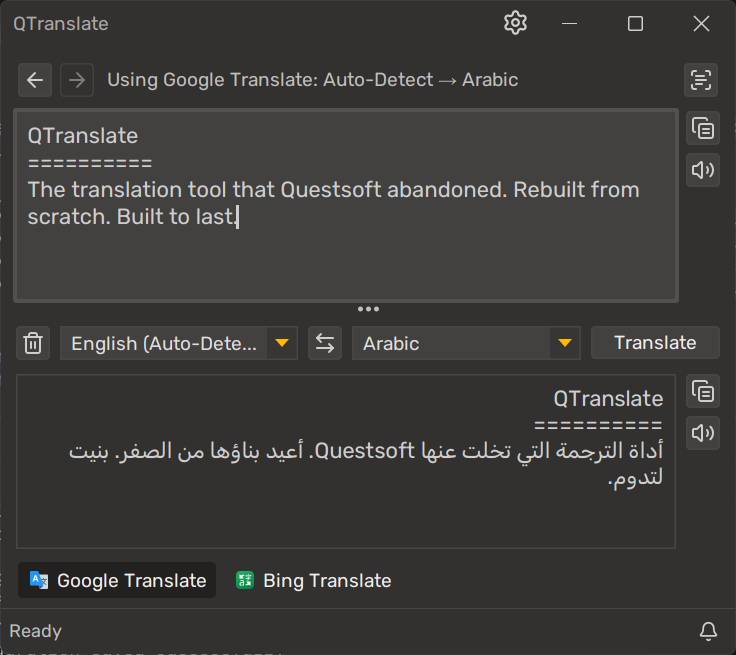
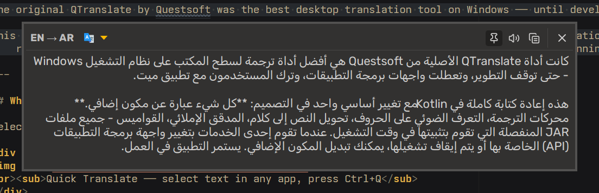
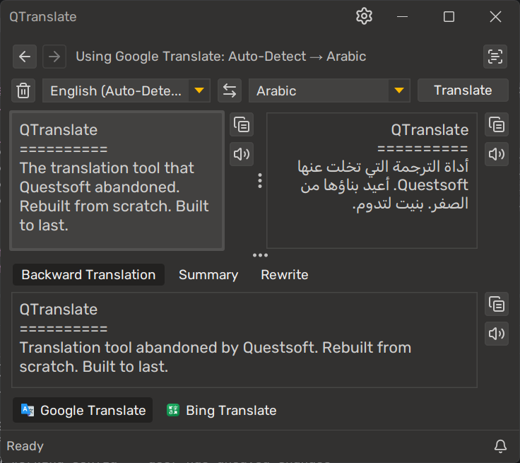
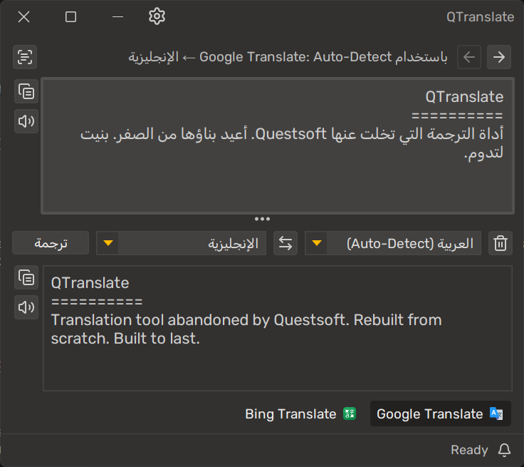
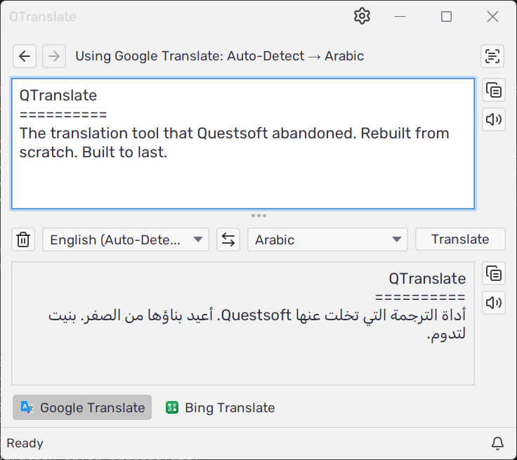
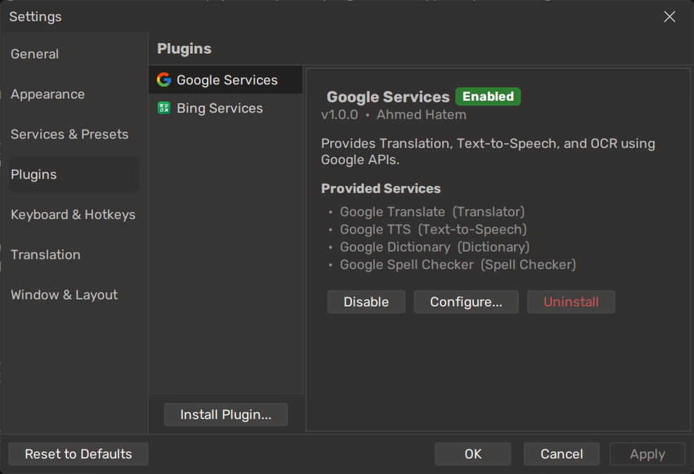

<div align="center">


# QTranslate

**The translation tool that Questsoft abandoned. Rebuilt from scratch. Built to last.**

[](https://github.com/ahatem/qtranslate/releases/latest)
[](LICENSE)
[](https://github.com/ahatem/qtranslate/actions)
[](CONTRIBUTING.md)
[](https://kotlinlang.org)

[**Download**](#-installation) · [**Plugin Guide**](wiki/Creating-a-Plugin.md) · [**Contributing**](CONTRIBUTING.md) · [**Wiki**](wiki/Home.md)

<br>



</div>

---

The original QTranslate by Questsoft was the best desktop translation tool on Windows — until development stopped, APIs broke, and users were left with a dead app.

This is a full rewrite in Kotlin with one core design change: **everything is a plugin.** Translation engines, OCR, TTS, spell checkers, dictionaries — all separate JARs you install at runtime. When a service changes its API or shuts down, you swap the plugin. The app keeps running.

---

## What it does

Select text anywhere → press `Ctrl+Q` → translation appears instantly. That's the core of it.

<div align="center">

<br><sub>Quick Translate — select text in any app, press Ctrl+Q</sub>
</div>

<br>

For longer work: open the main window, type or paste, translate. Switch engines in one click. Run OCR on a screenshot. Listen to pronunciation. Check spelling. Browse history. All from the keyboard, all without opening a browser.

<div align="center">
<table>
<tr>
<td align="center" width="50%">
<br>
<sub><b>Extra output panel</b> — backward translation, summary, or rewrite alongside the main result</sub>
</td>
<td align="center" width="50%">
<br>
<sub><b>RTL support</b> — full layout mirroring for Arabic, Hebrew, Farsi</sub>
</td>
</tr>
<tr>
<td align="center" width="50%">
<br>
<sub><b>Light theme</b> — fully themeable with FlatLaf, dark and light</sub>
</td>
<td align="center" width="50%">
<br>
<sub><b>Plugin manager</b> — install, configure, enable, disable at runtime</sub>
</td>
</tr>
</table>
</div>

---

## Features

### Translation

| | |
|---|---|
| **Quick Translate popup** | `Ctrl+Q` on any selected text — popup with result, no main window needed |
| **Instant translation** | Translates as you type with configurable debounce |
| **Inline replace** | `Ctrl+Shift+T` — translates selected text and pastes the result back in place |
| **Backward translation** | See the round-trip result alongside the main output — spots awkward phrasing instantly |
| **Summarize** | Get a condensed version of long text, configurable length |
| **Rewrite** | Rewrite in a different style: Formal, Casual, Concise, Detailed, or Simplified |
| **Translation history** | Full undo/redo through every past translation |

### Input

| | |
|---|---|
| **Screen OCR** | Draw a rectangle anywhere on screen, extract the text, translate it |
| **Spell checking** | Live underlines as you type, click a suggestion to apply |
| **Remove line breaks** | Strips newlines from pasted text so PDF content translates as sentences |
| **Language filter** | Pin 3–4 target languages so the picker isn't overwhelming |
| **Cycle languages** | `Ctrl+L` steps through pinned languages without touching the mouse |

### Services & plugins

| | |
|---|---|
| **Plugin system** | Install `.jar` plugins at runtime — no restart, no reinstall |
| **Service presets** | Save different engine combinations for different contexts |
| **Google Services** | Translator, TTS, OCR, Spell Checker, Dictionary — included |
| **Bing Services** | Translator, TTS, Spell Checker — included |

### Interface

| | |
|---|---|
| **Three layouts** | Classic (stacked), Side-by-side, Compact (tabbed) |
| **Global hotkeys** | Every action is bindable, configurable as global or app-local |
| **RTL support** | Full layout mirroring for Arabic, Hebrew, Farsi, and more |
| **15+ themes** | Dark and light, via FlatLaf — including animated transitions |
| **Portable** | Runs from any folder, all data lives next to the JAR |

---

## Installation

**Requires Java 11 or later** — [download from Adoptium](https://adoptium.net) if you need it.

1. Download `QTranslate-<version>.zip` from [**Releases**](https://github.com/ahatem/qtranslate/releases/latest)
2. Unzip anywhere
3. Run `QTranslate.jar`

```
QTranslate/
  ├── QTranslate.jar                ← double-click, or: java -jar QTranslate.jar
  ├── plugins/
  │     ├── google-services-plugin.jar
  │     └── bing-services-plugin.jar
  └── languages/
        ├── en-GB.toml
        ├── ar-SA.toml
        ├── de-DE.toml
        ├── es-ES.toml
        ├── fr-FR.toml
        ├── ja-JP.toml
        ├── pt-BR.toml
        ├── ru-RU.toml
        ├── tr-TR.toml
        └── zh-CN.toml
```

Google and Bing plugins are included. Add your API keys in **Settings → Plugins → [plugin] → Configure**.

> **Getting "This application requires a Java Runtime Environment"?**
> Java isn't installed or `JAVA_HOME` isn't set. This video covers the full process:
> **▶ [How to Install Java JDK and Set JAVA_HOME](https://youtu.be/VTzzmqNwGzM)** *(first 7 minutes)*

**Build from source** → [Building from Source](wiki/Building-from-Source.md)

---

## Quick start

1. Launch `QTranslate.jar` — it starts in the system tray
2. Select text anywhere on screen
3. Press `Ctrl+Q` — Quick Translate popup opens with the result ready
4. Press `Ctrl+E` — listen to the selected text
5. Press `Ctrl+I` — draw a screen region to OCR and translate

Open **Settings** (gear icon) to configure API keys, themes, hotkeys, and service presets.

---

## Plugins

**Installing a plugin:** Settings → Plugins → Install Plugin → select `.jar` → Enable → Configure → assign in Services & Presets

**Full guide** → [Installing Plugins](wiki/Installing-Plugins.md)

### Community plugins

> Built a plugin? [Submit it here](https://github.com/ahatem/qtranslate/issues/new?template=plugin_submission.md) — quality plugins get listed and promoted to all QTranslate users.

| Plugin | Services | Author |
|--------|----------|--------|
| *(be the first)* | | |

---

## Build a plugin

A minimal translator is ~50 lines of Kotlin. No framework, no registration — implement a few interfaces, build a fat JAR, install it through the UI.

```kotlin
class MyPlugin : Plugin<PluginSettings.None> {
    override val id      = "com.example.my-plugin"
    override val name    = "My Plugin"
    override val version = "1.0.0"

    override fun getSettings() = PluginSettings.None
    override fun getServices() = listOf(MyTranslatorService())
}
```

The bundled Google and Bing plugins are fully open source in `plugins/` — they're the best real-world reference for auth, language mapping, error handling, and settings.

**Full guide** → [Creating a Plugin](wiki/Creating-a-Plugin.md)

---

## Translate the interface

QTranslate ships with 11 languages built in:

**Arabic · Chinese · English · French · German · Japanese · Portuguese · Russian · Spanish · Turkish**

Want another language? Copy `languages/en.toml`, rename it to your language code, translate the values. No code needed.

**Guide** → [Adding a Language](wiki/Adding-a-Language.md)

---

## Architecture

Clean Architecture + MVI. Nothing leaks between layers:

```
:api        ← plugin interfaces — plugins only depend on this
:core       ← business logic, use cases, MVI stores
:ui-swing   ← Swing UI, Renderable<State> components
:app        ← composition root
:plugins/*  ← Google, Bing, community plugins
```

**Guide** → [Architecture](wiki/Architecture.md)

---

## Contributing

Bug fixes, features, translations, docs, and plugins all welcome. Look for [`good first issue`](https://github.com/ahatem/qtranslate/labels/good%20first%20issue) for well-scoped starting points.

→ [Contributing Guide](CONTRIBUTING.md)

---

[MIT License](LICENSE)

<div align="center">
<br>
<sub>Built with Kotlin · FlatLaf · Ktor · Coroutines</sub>
<br><br>
<sub>Found it useful? A ⭐ helps other people find the project.</sub>
</div>