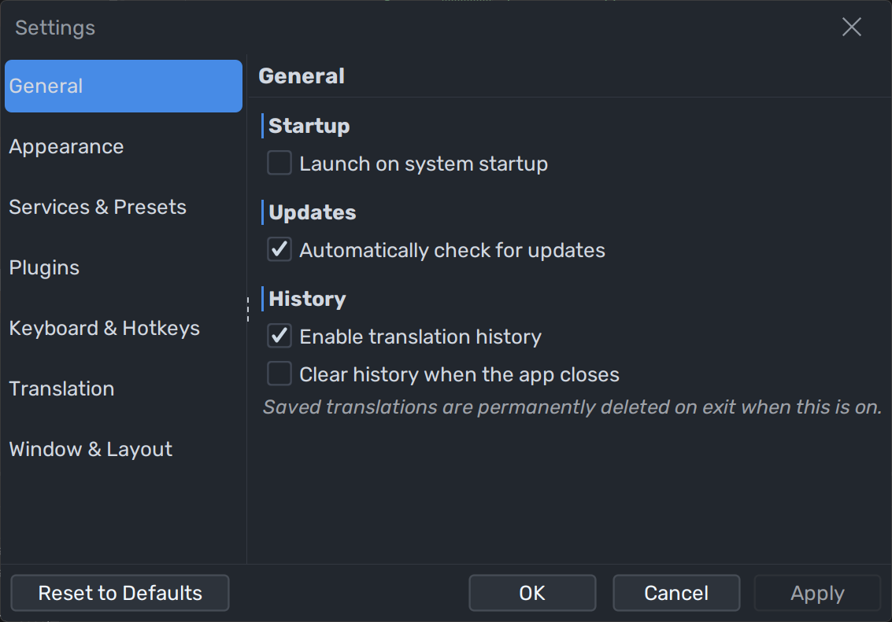

<div align="center">


# QTranslate

**A fast, extensible, plugin-driven desktop translation suite.**

Translate text, recognise text in images, listen to text-to-speech, and check spelling —
all from a single keyboard shortcut, without opening a browser.

<br>

[](https://github.com/ahatem/qtranslate/releases/latest)
[](LICENSE)
[](https://github.com/ahatem/qtranslate/actions)
[](CONTRIBUTING.md)
[](https://kotlinlang.org)

<br>

[**Download**](#-installation) · [**Plugin Guide**](wiki/Creating-a-Plugin.md) · [**Contributing**](CONTRIBUTING.md) · [**Wiki**](wiki/Home.md)

<br>

<!-- Main screenshot -->


</div>

---

## Overview

QTranslate is a modular desktop translation app built for power users who want speed and flexibility. Instead of locking you into one translation service, it lets you install, configure, and switch between any number of providers — translation engines, OCR services, TTS voices — all through a clean plugin system.

Press a hotkey, translate, listen, done.

<br>

<div align="center">
<table>
<tr>
<td align="center">
<br>
<sub><b>Quick Translate popup</b> — select text anywhere, press Ctrl+Q</sub>
</td>
<td align="center">
<br>
<sub><b>Settings</b> — themes, fonts, service presets, plugins</sub>
</td>
</tr>
<tr>
<td align="center">
<br>
<sub><b>Plugin Manager</b> — install and configure service plugins</sub>
</td>
<td align="center">
<br>
<sub><b>Light theme</b> — fully themeable with FlatLaf</sub>
</td>
</tr>
</table>
</div>

---

## ✨ Features

| | Feature | Description |
|--|---------|-------------|
| ⚡ | **Instant translation** | Translates as you type with a configurable debounce |
| 🔑 | **Global hotkeys** | Translate, OCR, or listen from any app with a keyboard shortcut |
| 💬 | **Quick translate popup** | Select text anywhere → press Ctrl+Q → done |
| 📷 | **OCR** | Capture any screen region and translate the text inside it |
| 🔊 | **Text-to-speech** | Listen to input or output in the correct language |
| ✍️ | **Spell checking** | Underlines mistakes as you type |
| 📜 | **Translation history** | Undo/redo through past translations |
| 🗂️ | **Service presets** | Save different service combinations and switch between them |
| 🔌 | **Plugin system** | Install, configure, and swap services at runtime — no restart |
| 🎨 | **Themes** | 15+ built-in FlatLaf themes, dark and light |
| 🌍 | **RTL support** | Layout mirrors for Arabic, Hebrew, and other RTL languages |
| 📦 | **Portable** | Runs from any folder — all data lives next to the JAR |

---

## 📦 Installation

### Download a release *(recommended)*

1. Go to [**Releases**](https://github.com/ahatem/qtranslate/releases/latest)
2. Download `QTranslate-<version>.zip`
3. Unzip anywhere — you get a `QTranslate/` folder
4. Run `QTranslate.jar`

```
QTranslate/
  ├── QTranslate.jar       ← double-click or: java -jar QTranslate.jar
  └── plugins/
        ├── bing-services-plugin.jar
        └── google-services-plugin.jar
```

>  **Requires Java 11 or later.** → [Download Temurin JDK](https://adoptium.net)

### ❓ Getting "This application requires a Java Runtime Environment"?

This means Java is not installed or not configured correctly on your machine. You need to install the Java JDK and set the `JAVA_HOME` environment variable so your system knows where to find it.

This video walks you through the entire process — downloading, installing, and setting `JAVA_HOME`:

**▶ [How to Install Java JDK and Set JAVA_HOME](https://youtu.be/VTzzmqNwGzM)**

> **Note:** You only need the first 7 minutes — that covers everything required to run QTranslate.

### Build from source

See [**Building from Source**](wiki/Building-from-Source.md).

---

## 🚀 Quick Start

1. **Launch** `QTranslate.jar`
2. **Select text** anywhere on your screen
3. Press **Ctrl+Q** to open the Quick Translate popup
4. Press **Ctrl+E** to listen to the selected text
5. Press **Ctrl+I** to OCR a screen region

Open **Settings** (the gear icon or `Ctrl+,`) to configure:
- Which services to use for translation, OCR, and TTS
- Your API keys for Google or Bing services
- Themes, fonts, and layout

---

## 🔌 Plugins

QTranslate ships with two plugins out of the box:

| Plugin | Services |
|--------|----------|
| **Google Services** | Translator · TTS · OCR · Spell Checker · Dictionary |
| **Bing Services** | Translator · TTS · Spell Checker |

### Installing additional plugins

1. **Settings → Plugins → Install Plugin…**
2. Select a `.jar` file
3. Enable the plugin and configure it
4. Assign it in **Settings → Services & Presets**

→ [Full installation guide](wiki/Installing-Plugins.md)

---

## 🧩 Community Plugins

> **Built a plugin?** Share it with the community by [opening a Plugin Submission issue](https://github.com/ahatem/qtranslate/issues/new?template=plugin_submission.md).
> Quality plugins get listed here and promoted to all QTranslate users. It's a great way to get your work noticed.

| Plugin | Type | Author | Description |
|--------|------|--------|-------------|
| *(be the first!)* | — | — | Open a submission issue to get listed |

---

## 🏗️ Building a Plugin

The plugin API is designed to be simple. A minimal translator plugin is ~50 lines of Kotlin. Plugins are loaded at runtime — users install your JAR through the UI, no restart required.

```kotlin
class MyPlugin : Plugin<PluginSettings.None> {
    override val id      = "com.example.my-plugin"
    override val name    = "My Plugin"
    override val version = "1.0.0"

    override fun getSettings() = PluginSettings.None
    override fun getServices() = listOf(MyTranslatorService())
}
```

### Learn from real examples

The bundled plugins are fully open source and live in this repository under `plugins/`. They are the best reference you have — real implementations of every service type, handling auth, language mapping, chunking, error handling, and settings:

| Source | What it demonstrates |
|--------|---------------------|
| [`plugins/google-services/`](plugins/google-services/src/main/kotlin) | Translator, TTS, OCR, Spell Checker, Dictionary — with `PluginSettings.Configurable` and `@field:Setting` for API key configuration |
| [`plugins/bing-services/`](plugins/bing-services/src/main/kotlin) | Translator, TTS, Spell Checker — with token-based auth, request chunking, and `SupportedLanguages.Dynamic` |
| [`plugins/common/`](plugins/common/src/main/kotlin) | Shared HTTP client, JSON parser, language mapper base class — reusable utilities your plugin can copy |

→ [**Full Plugin Development Guide**](wiki/Creating-a-Plugin.md)

---

## 🌍 Translating the Interface

QTranslate's UI can be translated into any language using a simple TOML file. Copy `en.toml`, rename it to your language code, translate the values, and you're done.

→ [**Adding a Language**](wiki/Adding-a-Language.md)

---

## 🏛️ Architecture

QTranslate follows **Clean Architecture** with an **MVI** pattern for the UI layer. The codebase is split into focused modules:

```
:api        ← plugin interfaces (plugins only depend on this)
:core       ← business logic, use cases, MVI stores
:ui-swing   ← Swing UI, Renderable<State> components
:app        ← composition root, wires everything together
:plugins/*  ← service implementations (Google, Bing, ...)
```

→ [**Architecture Guide**](wiki/Architecture.md)

---

## 🤝 Contributing

Contributions are welcome — bug fixes, features, translations, documentation, and plugins.

**Good first issues:** look for the [`good first issue`](https://github.com/ahatem/qtranslate/labels/good%20first%20issue) label — these are well-scoped tasks that don't require deep knowledge of the codebase.

→ [**Contributing Guide**](CONTRIBUTING.md)

---

## 📄 License

QTranslate is released under the [**MIT License**](LICENSE). You are free to use, modify, and distribute it.

---

<div align="center">

**Built with** [Kotlin](https://kotlinlang.org) · [FlatLaf](https://www.formdev.com/flatlaf/) · [Ktor](https://ktor.io) · [Coroutines](https://kotlinlang.org/docs/coroutines-overview.html)

<br>

*If QTranslate is useful to you, consider giving it a ⭐ — it helps others find the project.*

</div>