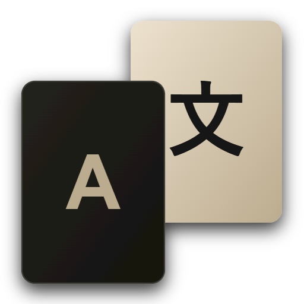
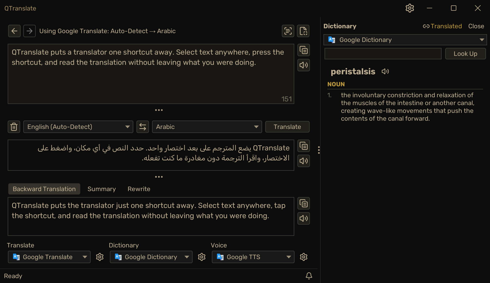
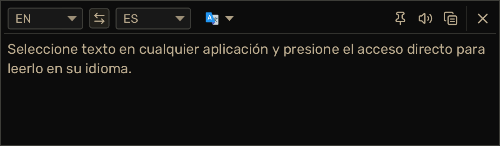
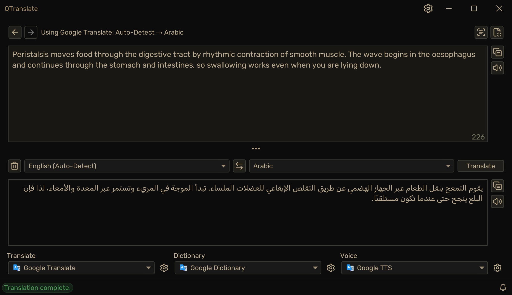
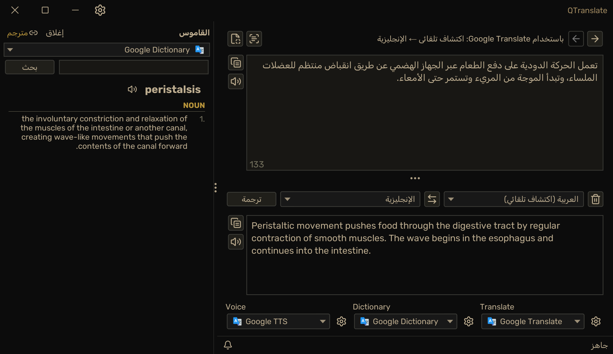
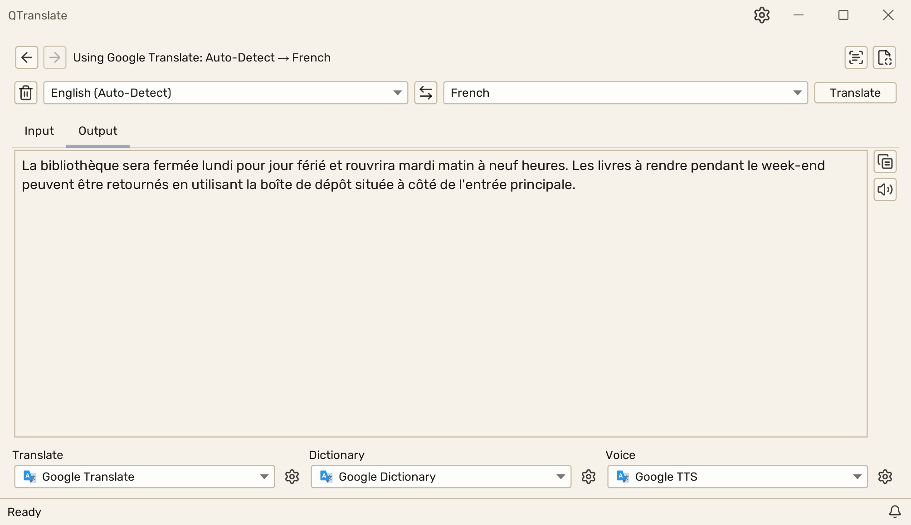
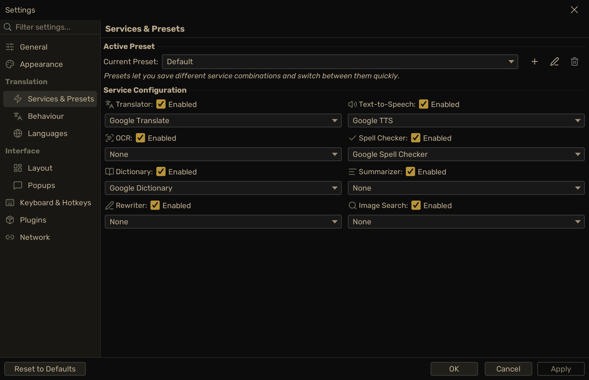
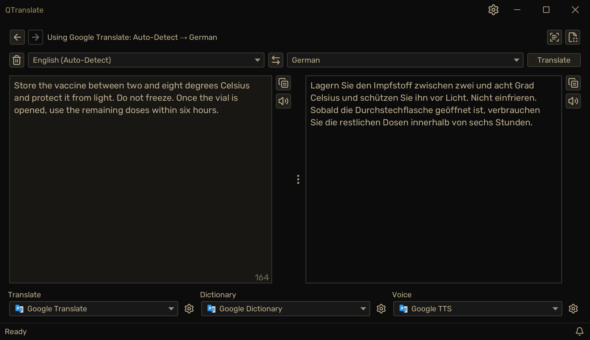
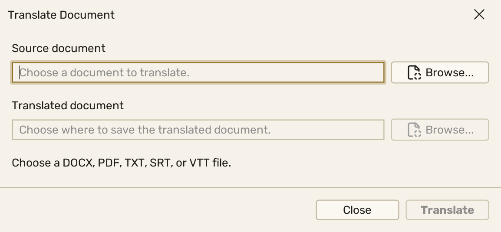

<div align="center">



# QTranslate

**The translation tool that Questsoft abandoned. Rebuilt from scratch. Built to last.**

**Select text in any application → press `Ctrl+Q` → get the translation without leaving what you're doing.**

Free · Open source · Plugin-powered · Local or cloud services

[](https://github.com/ahatem/QTranslate/releases/latest)
[](https://github.com/ahatem/QTranslate/releases)
[](LICENSE)
[](https://github.com/ahatem/QTranslate/actions)
[](CONTRIBUTING.md)
[](https://kotlinlang.org)

[**Download**](#installation) · [**Plugin Guide**](wiki/Creating-a-Plugin.md) · [**Build from source**](wiki/Building-from-Source.md) · [**Support**](#support-qtranslate) · [**Contributing**](CONTRIBUTING.md) · [**Wiki**](wiki/Home.md)

<br>



</div>

---

## Why QTranslate exists

I relied heavily on the original QTranslate while studying veterinary medicine. I was constantly reading material filled with medical terminology, anatomy, drug names, Latin terms, and unfamiliar words.

What made it special was not just translation. It was the lack of friction: **select something → press a hotkey → understand it → keep reading.**

When the original project was abandoned and its services gradually stopped working, I could not find another application that felt the same. So I rebuilt it from scratch.

The rewrite is built around one lesson from the original: **a translation app should not die because one service changes its API.** Translation engines, OCR, TTS, spell checkers, dictionaries, and AI services are plugins that can be replaced independently.

I built QTranslate for myself first, but I keep it free and open source because translation, reading, and learning tools should not require another subscription.

— **Ahmed Hatem, creator of QTranslate**

---

## What it does

Select text anywhere → press `Ctrl+Q` → translation appears instantly. That's the core of it.

<div align="center">

<br><sub>Quick Translate — select text in any app, press <kbd>Ctrl+Q</kbd></sub>
</div>

<br>

For longer work: open the main window, type or paste, translate. Switch engines in one click. Translate a document while preserving its structure. Run OCR on a screenshot. Listen to pronunciation. Check spelling. Browse history. All from the keyboard, all without opening a browser.

<div align="center">
<table>
<tr>
<td align="center" width="50%">
<br>
<sub>Translate, summarize, rewrite, spell-check, and revisit past translations</sub>
</td>
<td align="center" width="50%">
<br>
<sub>Use Arabic, Hebrew, Farsi, and other RTL languages with a mirrored layout</sub>
</td>
</tr>
<tr>
<td align="center" width="50%">
<br>
<sub>Keep input and output tidy in a smaller tabbed window</sub>
</td>
<td align="center" width="50%">
<br>
<sub>Choose services, save presets, and manage API keys in one place</sub>
</td>
</tr>
<tr>
<td align="center" width="50%">
<br>
<sub>Compare source and translation without switching panes</sub>
</td>
<td align="center" width="50%">
<br>
<sub>Translate DOCX, PDF, TXT, SRT, and VTT with progress and cancellation</sub>
</td>
</tr>
</table>
</div>

---

## Who it is for

- **Readers and language learners** — understand unfamiliar words and passages without constantly switching applications.
- **Students and researchers** — translate terminology, documents, screenshots, and reference material with the services you choose.
- **Professionals** — work across desktop applications and choose local or cloud services based on the material being translated.
- **Power users and developers** — configure global hotkeys, build service presets, and extend QTranslate with plugins.

### Privacy and local options

QTranslate lets you choose which services receive your text. You can point AI Services at a local Ollama or LM Studio server, or use a self-hosted LibreTranslate instance. Requests sent to those configured local endpoints stay on your machine or network; requests sent to a cloud service are handled by that provider.

Plugins run on your computer with access to local resources, so install third-party plugin JARs only from publishers you trust.

---

## Features

### Translation

| | |
|---|---|
| **Quick Translate popup** | `Ctrl+Q` on any selected text — popup with result, no main window needed |
| **Image search** | `Ctrl+Shift+Q` on any selected word — a grid of reference pictures from Wikimedia Commons, enlarged in place, licence shown and source page a click away. For the words a definition alone does not settle |
| **Instant translation** | Translates as you type with configurable debounce |
| **Inline replace** | `Ctrl+Shift+T` — translates selected text and pastes the result back in place |
| **Backward translation** | See the round-trip result alongside the main output — spots awkward phrasing instantly |
| **Summarize** | Get a condensed version of long text, configurable length |
| **Rewrite** | Rewrite in a different style: Formal, Casual, Concise, Detailed, or Simplified |
| **Translation history** | Full undo/redo through every past translation |
| **Translation rules** | Auto-correct source text before translating — fix common mistakes, expand abbreviations, normalize input |
| **Document translation** | Translate DOCX, PDF, TXT, SRT, and VTT files with progress and cancellation; DOCX structure and subtitle timing are preserved |

### Input

| | |
|---|---|
| **Screen OCR** | Draw a rectangle anywhere on screen — translate, copy text, copy image, or save; re-crop without closing |
| **Spell checking** | Live underlines as you type, click a suggestion to apply |
| **Remove line breaks** | Strips newlines from pasted text so PDF content translates as sentences |
| **Language filter** | Pin 3–4 target languages so the picker isn't overwhelming |
| **Cycle languages** | `Ctrl+L` steps through pinned languages without touching the mouse |

### Services & plugins

| | |
|---|---|
| **Plugin system** | Install `.jar` plugins at runtime — no restart, no reinstall |
| **Plugin manager** | Search and filter installed plugins, inspect metadata and errors, configure or toggle services inline, and install by file or drag-and-drop |
| **Service presets** | Save different engine combinations for different contexts |
| **Google Services** | Translator, TTS, OCR, Spell Checker, Dictionary — included |
| **Bing Services** | Translator, TTS, Spell Checker — included |
| **AI Services** | Translator, Summarizer, Rewriter, Spell Checker, Dictionary, Vision OCR — via [OpenRouter](https://openrouter.ai) or another OpenAI-compatible endpoint. [Setup guide](wiki/AI-Services.md) |
| **Free translation choices** | Mozhi, MyMemory, DeepL web fallback, Reverso, and Yandex Web work without an API key; unofficial endpoints may change or be rate-limited |
| **Local and self-hosted options** | Point AI Services at a local [Ollama](https://ollama.com) or LM Studio server, or use a self-hosted LibreTranslate instance. Local endpoints need no account or API key. [Setup guide](wiki/AI-Services.md) |
| **Reference services** | Wikipedia and Wiktionary lookups, and Wikimedia Commons image search, through official MediaWiki APIs |
| **CSV dictionary** | Point it at your own CSV — a glossary, an abbreviation list, a table of error codes, a set of study notes — and look terms up in it. Which columns hold the term and its meaning is configurable, and nothing leaves your machine |

### Interface

| | |
|---|---|
| **Three layouts** | Classic (stacked), Side-by-side, Compact (tabbed) |
| **Global hotkeys** | Every action is bindable, configurable as global or app-local |
| **RTL support** | Full layout mirroring for Arabic, Hebrew, Farsi, and more |
| **QTranslate Light & Dark** | Purpose-built defaults with OS light/dark synchronization, plus 30+ FlatLaf themes and custom IntelliJ `.theme.json` support |
| **Portable** | Runs from any folder, all data lives next to the JAR |

---

## Installation

All downloads live on the [**latest release page**](https://github.com/ahatem/QTranslate/releases/latest).

| Your platform | Download | Java required |
|---|---|---|
| **Windows** | `QTranslate-<version>-windows-x64.zip` | **No** — Java is included |
| **macOS / Linux** | `QTranslate-<version>.zip` | Java 11+ |
| **Any (app only, no plugins)** | `QTranslate-App-<version>.jar` | Java 11+ |

The Windows and portable ZIP packages contain all bundled plugins, languages, themes, and icon sets. The app-only JAR contains no plugins and is intended for an existing or manually assembled setup.

### Windows

1. Download `QTranslate-<version>-windows-x64.zip`
2. Extract to a writable folder
3. Run `QTranslate.exe`

No Java installation needed — the package ships its own trimmed runtime.

### macOS and Linux

1. Install **Java 11 or later** ([Temurin](https://adoptium.net) recommended)
2. Download and extract `QTranslate-<version>.zip`
3. Run `QTranslate.jar`, or `java -jar QTranslate.jar` from a terminal

```
QTranslate/
  ├── QTranslate.jar                  ← double-click, or: java -jar QTranslate.jar
  ├── plugins/
  │     ├── google-services-plugin.jar
  │     ├── bing-services-plugin.jar
  │     ├── mozhi-services-plugin.jar
  │     └── ...
  ├── themes/
  │     └── kokedera.theme.json       ← community theme included; drop more .theme.json files here
  ├── languages/
  │     ├── ar-SA.toml
  │     ├── zh-CN.toml
  │     ├── de-DE.toml
  │     └── ...
  ├── icons/
  │     ├── material-symbols/
  │     ├── tabler/
  │     ├── phosphor/
  │     └── heroicons/                ← extra icon sets; drop a set's folder in to add it
  ├── LICENSE                         ← Mozilla Public License 2.0
  ├── NOTICE.md                       ← licensing scope and earlier-release notice
  ├── LICENSES/
  │     └── QTranslate-MIT.txt        ← license used for earlier revisions
  └── THIRD_PARTY_LICENSES/
        ├── Lucide-ISC.txt
        ├── MaterialSymbols-Apache-2.0.txt
        └── ...                       ← notices for bundled third-party material
```

Bundled plugins: Google, Bing, AI Services, DeepL, Mozhi, MyMemory, LibreTranslate Local, Reverso, Yandex Web, Wikimedia Reference, and CSV Dictionary. Configure a service from the service selector or **Settings → Plugins**.

> **Individual plugin JARs** are also attached to each release. They are only for adding or
> updating a single plugin in an existing install — you do not need them for a fresh setup.

> **Getting "This application requires a Java Runtime Environment"?**
> Java isn't installed or `JAVA_HOME` isn't set — or use the Windows package, which needs neither.
> **▶ [How to Install Java JDK and Set JAVA_HOME](https://youtu.be/VTzzmqNwGzM)** *(first 7 minutes)*

**Build from source** → [Building from Source](wiki/Building-from-Source.md)

**Preparing a release** → [Release Guide](wiki/Releasing.md)

---

## Quick start

1. Launch `QTranslate.exe` on Windows, or `QTranslate.jar` from the portable package — it starts in the system tray
2. Select text anywhere on screen
3. Press `Ctrl+Q` — Quick Translate popup opens with the result ready
4. Press `Ctrl+D` — open the Dictionary for the selected word
5. Press `Ctrl+Shift+Q` — see pictures of the selected word
6. Press `Ctrl+E` — listen to the selected text
7. Press `Ctrl+I` — draw a screen region to OCR and translate

Open **Settings** (gear icon) to configure API keys, themes, hotkeys, and service presets.

---

## Plugins

**Installing a plugin:** Settings → Plugins → Install Plugin, or drop a plugin JAR onto the plugin panel. Review its details, enable it, configure it, then assign its services under Services & Presets.

**Full guide** → [Installing Plugins](wiki/Installing-Plugins.md)

### Community plugins

The in-app catalog and independent plugin updater are planned but are not available yet. Until then, install only JARs from publishers you trust and verify any checksum they provide.

> **Built a plugin?** Publish its source, release JAR, compatibility range, and checksum. See the [plugin publishing guide](wiki/Creating-a-Plugin.md#publishing-on-github).

---

## Build a plugin

A minimal translator is ~50 lines of Kotlin. No framework, no registration — implement a few interfaces, build a fat JAR, install it through the UI.

```kotlin
class MyPlugin : Plugin<PluginSettings.None> {
    override val id      = "com.example.my-plugin"
    override val name    = "My Plugin"
    override val version = "1.0.0"

    override fun getSettings() = PluginSettings.None
    override fun getServices() = listOf(MyTranslatorService())
}
```

All bundled plugins are open source under `plugins/`. They provide real-world examples of authentication, no-key services, local endpoints, throttling, language mapping, batch translation, dictionaries, and structured errors.

**Full guide** → [Creating a Plugin](wiki/Creating-a-Plugin.md)

---

## Translate the interface

QTranslate ships with 16 built-in locale files:

**Arabic · Bengali · Chinese (Simplified and Traditional) · English · French · German · Hungarian · Italian · Japanese · Portuguese · Russian · Spanish · Turkish · Ukrainian · Vietnamese**

Want another language? Copy `languages/en-GB.toml`, rename it to your language code, translate the values. No code needed.

**Guide** → [Adding a Language](wiki/Adding-a-Language.md)

---

## Architecture

Clean Architecture + MVI. Nothing leaks between layers:

```
:api          ← plugin interfaces — plugins only depend on this
:core         ← business logic, use cases, MVI stores
:ui-swing     ← Swing UI, Renderable<State> components
:app          ← composition root
:plugins/*    ← independently packaged service implementations
:plugins/common ← shared HTTP client, JSON, language utilities
```

**Guide** → [Architecture](wiki/Architecture.md)

---

## Support QTranslate

QTranslate is free and open source, and I want it to stay that way.

I am the primary developer behind the project. Maintenance means more than adding features: providers change APIs, operating systems change behaviour, plugins need updates, bugs need investigation, releases need testing, and users need support.

If QTranslate saves you time, helps you study, or becomes one of those utilities you use every day, consider supporting its development. Even a small recurring contribution makes it easier to work on QTranslate consistently.

[**GitHub Sponsors**](https://github.com/sponsors/ahatem) · [**Buy Me a Coffee**](https://www.buymeacoffee.com/ahmedhatem) · [**Supporters**](SPONSORS.md)

Financial support is completely optional. You can also help by starring and sharing QTranslate, reporting reproducible bugs, translating the interface, improving documentation, building plugins, or contributing code.

— **Ahmed**

### Professional or organization use

Using QTranslate in a team or organization and need something specific? I may be available for paid professional work around the project, including:

- custom QTranslate plugins;
- private translation-service or API/LLM integrations;
- terminology and dictionary integrations;
- deployment and organization-specific configuration;
- technical consulting and support.

This work supports development around the free, open-source application; it does not create a paid edition or give sponsors control over technical decisions. For professional inquiries, use the public contact details on [my GitHub profile](https://github.com/ahatem).

---

## Contributing

Bug fixes, features, translations, docs, and plugins all welcome. Look for [`good first issue`](https://github.com/ahatem/QTranslate/labels/good%20first%20issue) for well-scoped starting points.

→ [Contributing Guide](CONTRIBUTING.md)

**QTranslate was created by Ahmed Hatem and is maintained with contributions from the QTranslate community.**

---

## License

QTranslate source code is available under the [Mozilla Public License 2.0](LICENSE). Earlier revisions remain available under the MIT License; see [NOTICE.md](NOTICE.md) for the transition and third-party notices.

<div align="center">
<br>
<sub>Built with Kotlin · FlatLaf · Ktor · Coroutines</sub>
<br><br>
<sub>Found it useful? A ⭐ helps other people find the project.</sub>
</div>
